# Traffic Police Database System
### Aim
To create a usable end to end system that will allow officers to record and
retrieve information about vehicles, people and traffic incidents.

## Contents
- [About this project](#about-this-project)
- [Disclaimer](#disclaimer)
- [Requirements](#requirements)
- [Manual](#manual)
- [Final Comments](#some-final-comments)

# About this project

This project was initially assigned to me in one of my modules during my computer science degree. As part of the module requirements, I had to create this same system using the LAMP stack (Linux, Apache, MySQL and PHP). However, I did not feel that I accomplished that task to my full potential and to the full potential of key design principles (don't get me wrong, I passed the module, I just knew I could do better if I re-created it with the technologies I understood.) So here is version 2, but this time using Python and Django.

## Disclaimer
Data used for this task is all artificial, in no way shape or form does any data represent real people, events, vehicles or incidents. Although location data is real, these were randomly generated for people in the data and therefore don't reflect reality.

## Requirements
- django
- django-auditlog

If you wish to clone the project, don't forget to create a `.env` file in which you'll need to place your Django secret key.

Also, you may need to customise some of the models in order to add some artificial data, as some models had data imports during migration, whereas some did not, and the ordering of this data establishment is important for a working app.

## Manual
Accessing the system can be done by using an assigned username and password. Once logged in, you will be greeted by the home page (dashboard), where you will see a variety of navigation options.

### User Type
Users are broken down into two categories: officers and administrators. Here is a list of what each user can achieve via the system:

**Officer:**
- Access DB Tools
- People - View/Search/Add
- Vehicles - View/Search/Add
- Reports - View/Search/Add/Edit
- Change Password

**Administrator:**
- All 'Officer' system privileges by default
- Admin Tools Enabled
- Add Fines to Existing Reports/Incidents
- Manage Users - Add/Delete (Officers and other Admins)
- Audit Log - View

### Pages

**Home Page**

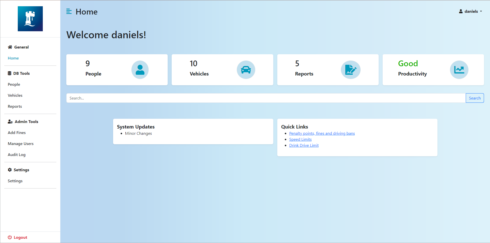

The home page's main design purpose is for navigation and information updates.
From here a user can use the navigation panel on the side to access the different features, or they can click the user dropdown in the top right corner to change password or logout.

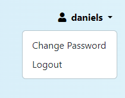

**DB Tools:**

**_1. People_**
- Here you can search the database for existing records of people. You may wish to search by Name or Licence.

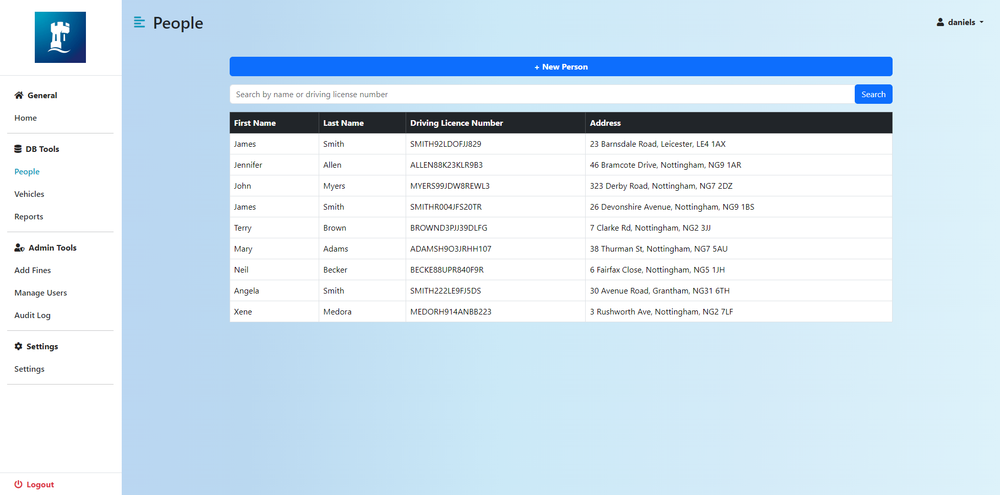

- You can also add new people by pressing the '+ New Person' button, in which case you'll be greeted by this form:

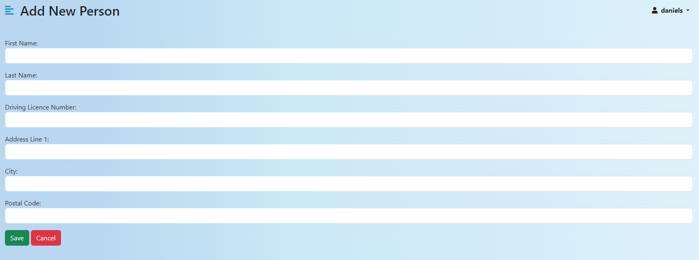

**_2. Vehicles_**
- Similar to the people page, you may explore existing records of vehicles in the database. Search by registration number.

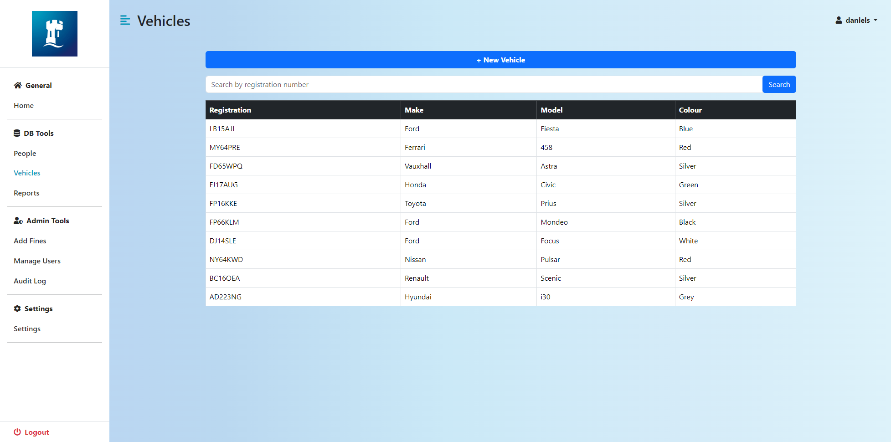

- Again, you can add new vehicles by pressing the '+ New Vehicle' button, which will take you to this form:

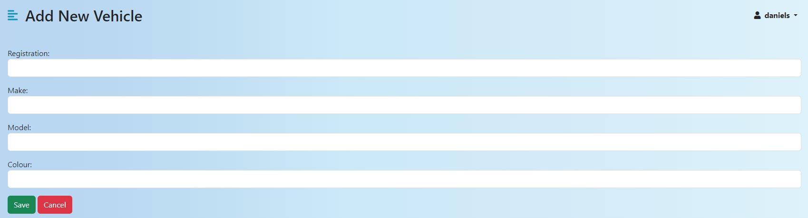

**_3. Reports_**
- Like with people and vehicles, you can view and search for reports by person involved or the incident's description.

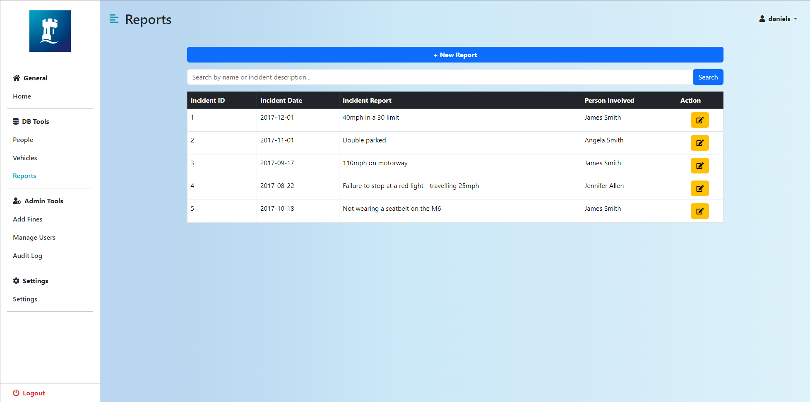

- By clicking '+ New Report' you can add new reports for incidents.
- Or you can edit existing reports by clicking the yellow (edit) action button, which will take you to this page:

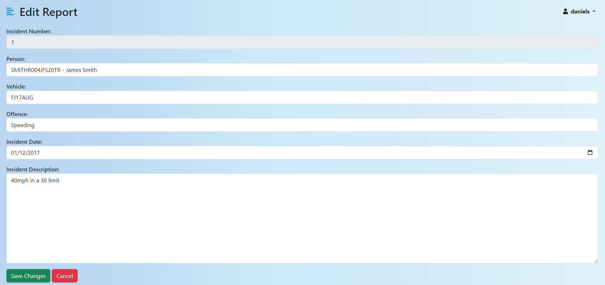
- Here you can make changes and then save to update the report in the database.

**Admin Tools:**

**_1. Fines_**
- Here you can add any determined penalty to the incident of choice.
- Click The dropdown under 'incident' in order to select the incident requiring a new fine. Then enter the fine amount (£) and points which should be attached to this incident. Finally, save the changes and they'll be updated in the database.
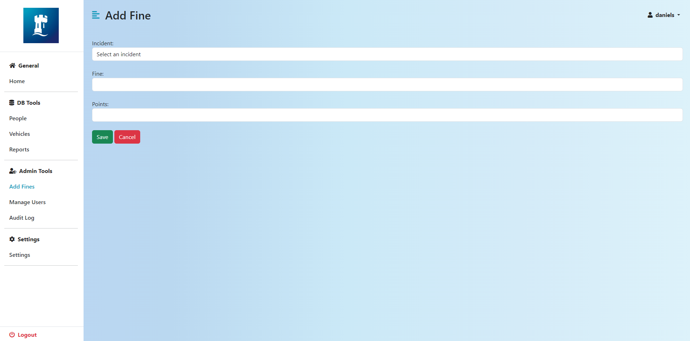

**_2. User Management_**
- Here an admin user can create or delete users for the system.
- To delete a user, press the delete button which should require another confirmation in order to complete the deletion.
- To add a new user, simply press the '+ New User' button and fill out the form as with other forms before. _Remember to check the admin option if you are creating a new admin user._

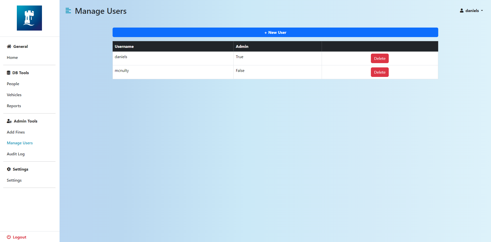
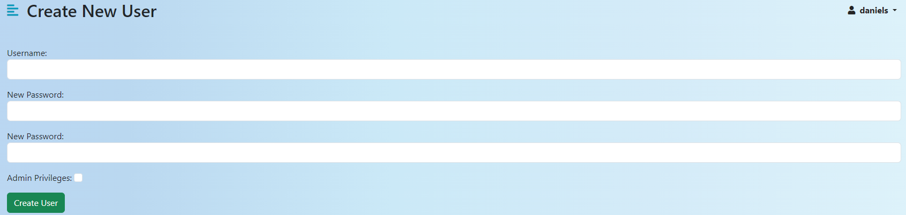

**_3. Audit Log_**
- This page shows the trail of user logs on different CRUD operations within the system.

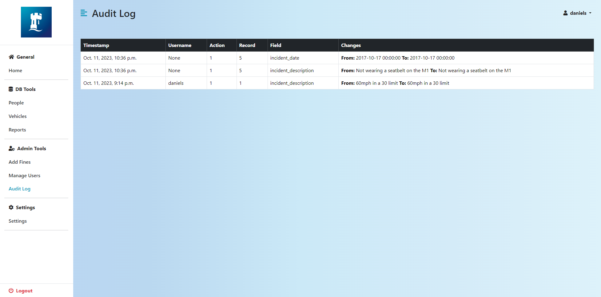

## Some Final Comments
I understand that it's still not perfect, but it was a nice challenge to re-create something that I thought was an interesting project.

Here are some things that could be better or should have been implemented already:
- Common/shared templating especially for adding (users, vehicles, reports etc.)
- More tests and error handling blocks
- Declaring more concrete ownership between vehicles and people.
- Existing fines should be viewable.

## Improving Even Further
Here are some things that could also be implemented as future features:
- Car API to get ready to use MAKE and MODEL for vehicles.
- Using the UK Gov DVLA Api, officers should be allowed to check if a vehicle has valid Tax and MOT.